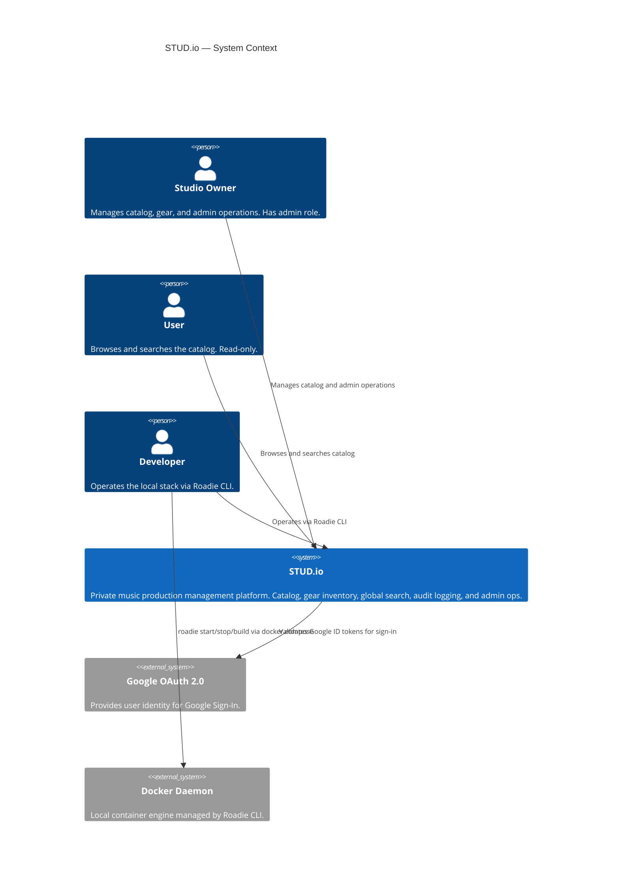
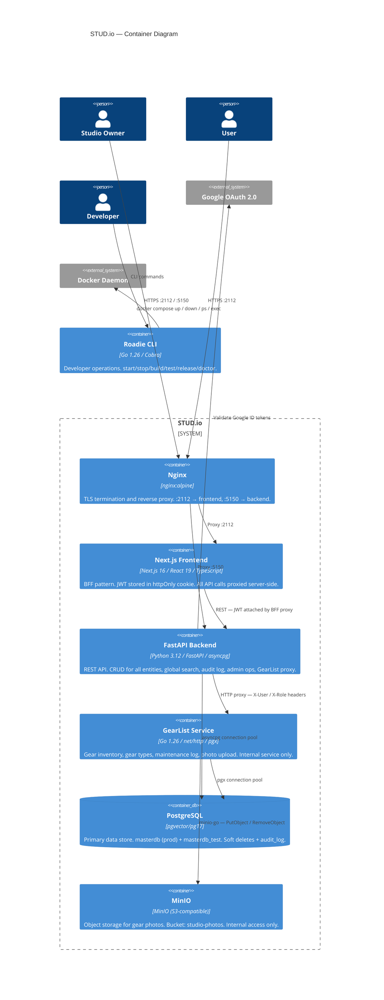
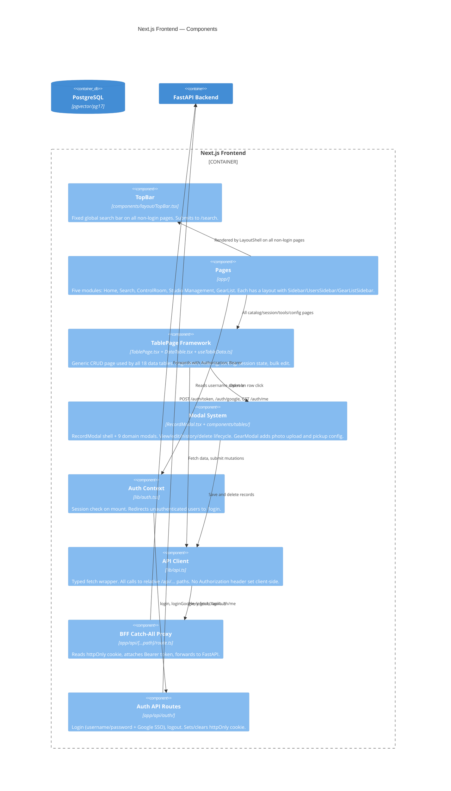
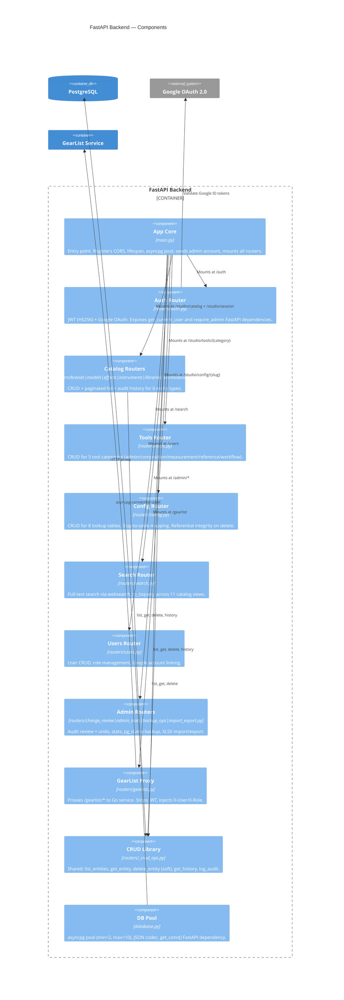
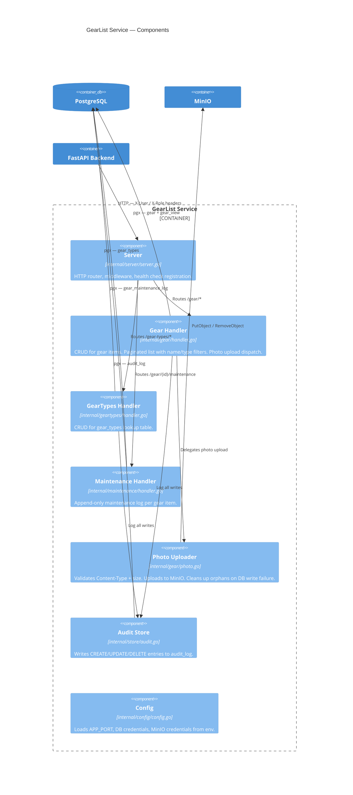
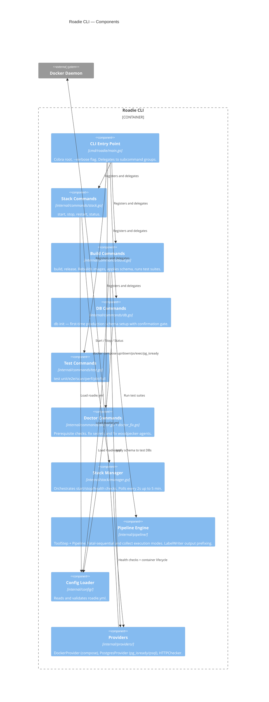
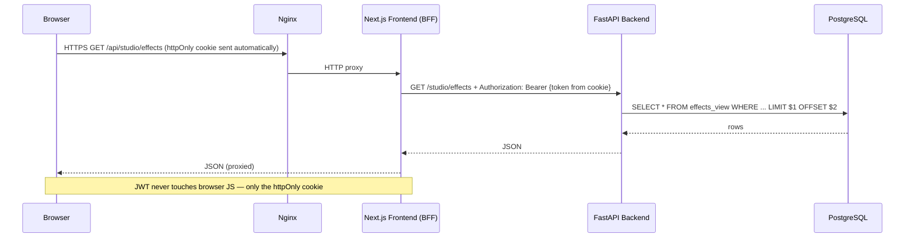
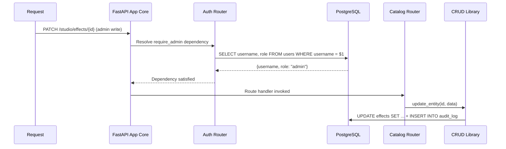
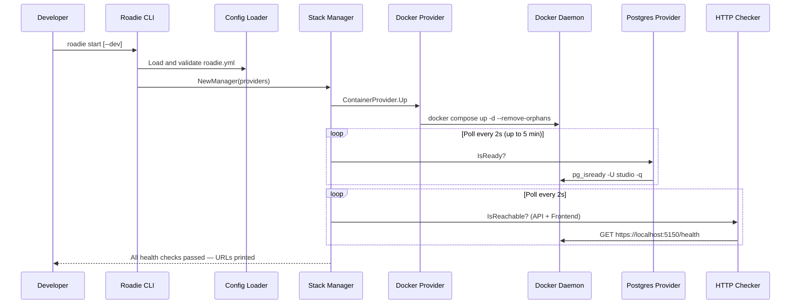
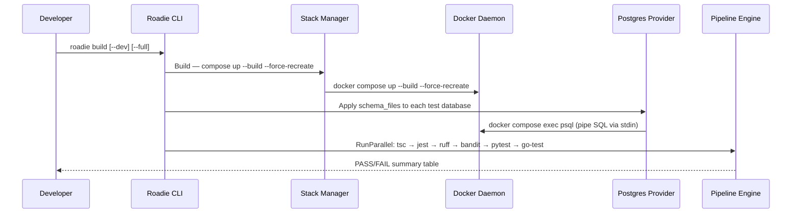

# C4 Architecture — STUD.io

All diagrams use [Mermaid C4](https://mermaid.js.org/syntax/c4.html) and render in GitHub, VS Code, and any Markdown viewer with Mermaid support.

**Update policy:** See `CLAUDE.md` — Architecture diagrams section. Any change to a service, container, module, or significant component requires updating the relevant diagram below before the task is considered done.

---

## Level 1 — System Context

---

## Level 2 — Containers

---

## Level 3 — Frontend Components

---

## Level 3 — FastAPI Backend Components

---

## Level 3 — GearList Service Components

---

## Level 3 — Roadie CLI Components

---

## Level 4 — BFF JWT Flow

---

## Level 4 — FastAPI Auth Dependency Chain

---

## Level 4 — Roadie Start Flow

---

## Level 4 — Roadie Build Flow

