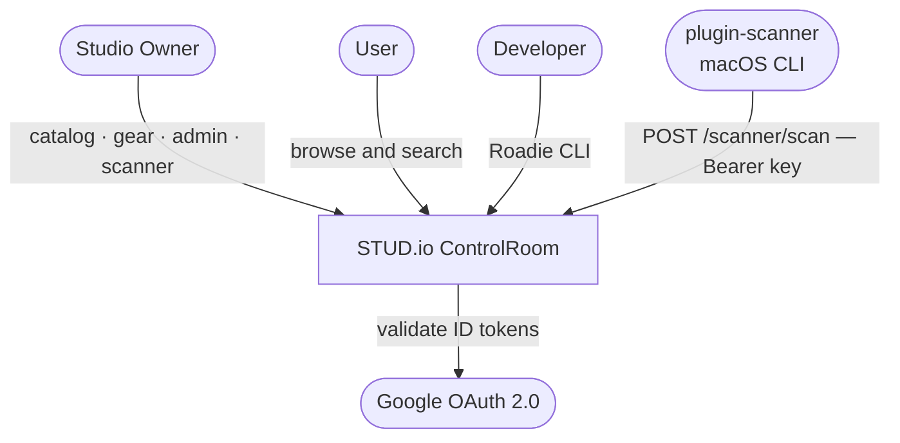

# L1 — System Context

> Who uses STUD.io and what external systems does it depend on.

```mermaid
graph TB
    owner(["Studio Owner"])
    user(["User"])
    dev(["Developer"])

    studio["STUD.io ControlRoom"]

    google(["Google OAuth 2.0"])
    scannercli(["plugin-scanner\nmacOS CLI"])

    owner -->|"catalog · gear · admin · scanner"| studio
    user -->|"browse and search"| studio
    dev -->|"Roadie CLI"| studio
    studio -->|"validate ID tokens"| google
    scannercli -->|"POST /scanner/scan — Bearer key"| studio
```
