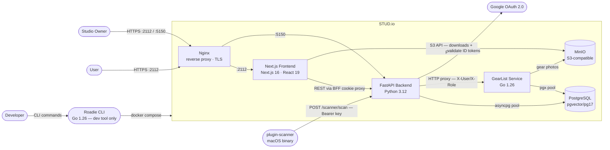

# L2 — Containers

> The deployable pieces inside STUD.io and how they communicate.

```mermaid
graph LR
    owner(["Studio Owner"])
    user(["User"])
    dev(["Developer"])

    subgraph system ["STUD.io"]
        nginx["Nginx\nreverse proxy · TLS"]
        frontend["Next.js Frontend\nNext.js 16 · React 19"]
        backend["FastAPI Backend\nPython 3.12"]
        gearlist["GearList Service\nGo 1.26"]
        db[("PostgreSQL\npgvector/pg17")]
        minio[("MinIO\nS3-compatible")]
    end

    google(["Google OAuth 2.0"])
    roadie(["Roadie CLI\nGo 1.26 — dev tool only"])
    scannercli(["plugin-scanner\nmacOS binary"])

    owner -->|"HTTPS :2112 / :5150"| nginx
    user -->|"HTTPS :2112"| nginx
    nginx -->|":2112"| frontend
    nginx -->|":5150"| backend
    frontend -->|"REST via BFF cookie proxy"| backend
    frontend -->|"S3 API — downloads + photos"| minio
    backend -->|"asyncpg pool"| db
    backend -->|"HTTP proxy — X-User/X-Role"| gearlist
    backend -->|"validate ID tokens"| google
    gearlist -->|"pgx pool"| db
    gearlist -->|"gear photos"| minio
    roadie -->|"docker compose"| system
    scannercli -->|"POST /scanner/scan — Bearer key"| backend
    dev -->|"CLI commands"| roadie
```
