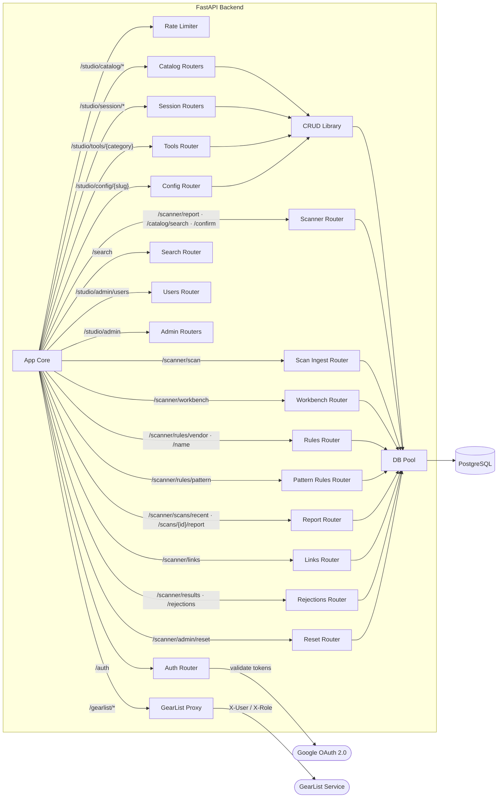

# L3 — FastAPI Backend Components

> Components inside the FastAPI Backend container.

| Component | Technology | Role |
|---|---|---|
| App Core | FastAPI / Python | CORS, lifespan, pool, admin seed, rate limiter, router mounts |
| Rate Limiter | SlowAPI | Per-user JWT sub key; falls back to client IP |
| Auth Router | FastAPI / Python | JWT (HS256) + Google OAuth; provides `get_current_user` and `require_admin` |
| Catalog Routers | FastAPI / Python | CRUD + history for brands and models |
| Session Routers | FastAPI / Python | CRUD + history for effects, instruments, libraries, workstations |
| Tools Router | FastAPI / Python | CRUD for five tool categories |
| Config Router | FastAPI / Python | CRUD for seven lookup tables; referential integrity on delete |
| Search Router | FastAPI / Python | Full-text search across 11 views; entity typeahead |
| Users Router | FastAPI / Python | User CRUD, role management, Google account linking |
| Admin Routers | FastAPI / Python | Backup, restore, verify, change review, stats, XLSX import/export |
| GearList Proxy | FastAPI / httpx | Catch-all proxy to the GearList Go service |
| Scanner Router | FastAPI / Python | Report · catalog search · confirm/dismiss/keep actions (`scanner.py`). Keys + exclusions live in the Admin Routers (`scanner_admin.py`) |
| Scan Ingest Router | FastAPI / Python | `POST /scanner/scan` (API key auth) — resolution precedence link→alias→exclusion→fuzzy (`scanner_ingest.py`) |
| Workbench Router | FastAPI / Python | Rules-applied workbench view at `/scanner/workbench` |
| Rules Router | FastAPI / Python | Vendor + name rule CRUD, toggle, acknowledge-clean (`scanner_rules.py`) |
| Pattern Rules Router | FastAPI / Python | Pattern rule CRUD + counts; alias-writing acknowledge-clean (`scanner_pattern_rules.py`, U-12/U-14); pure resolver in `scanner_pattern_eval.py` (U-13) |
| Report Router | FastAPI / Python | Recent scan list (`/scanner/scans/recent`) + raw scan report |
| Links Router | FastAPI / Python | Find-link candidates and link creation |
| Rejections Router | FastAPI / Python | Reject match, list rejections, delete rejection |
| Reset Router | FastAPI / Python | Soft reset (disable all rules) and hard reset (full wipe) at `/scanner/admin/reset` |
| CRUD Library | Python | Shared list, get, soft-delete, history, log_audit |
| DB Pool | asyncpg | Connection pool min=2 max=10; provides `get_conn()` dependency |
