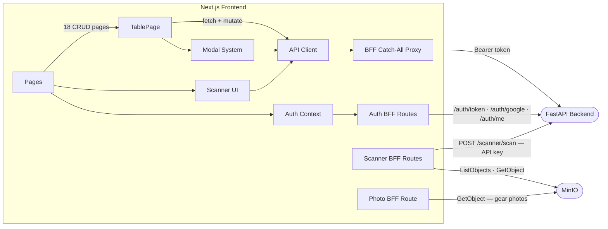

# L3 — Frontend Components

> Components inside the Next.js Frontend container.

| Component | Technology | Role |
|---|---|---|
| Pages | Next.js App Router | All module pages — ControlRoom, Studio Management, GearList, Search, Home |
| TablePage | React / TanStack Table | Generic CRUD page used by all 18 data tables |
| Modal System | React | Nine domain modals — view, edit, history, delete lifecycle |
| Scanner UI | React / react-virtual | Eight-bucket triage with virtual scrolling; rules management (vendor/name/pattern CRUD via RuleSection + useRules); Scan Report page (raw results accordion with scan picker, ScanReportPage) |
| Auth Context | React Context | Session state; redirects unauthenticated users to /login |
| API Client | TypeScript / fetch | Typed wrapper for all /api/... calls; no auth header set client-side |
| BFF Catch-All Proxy | Next.js Route Handler | Reads httpOnly cookie, attaches Bearer token, forwards to FastAPI |
| Auth BFF Routes | Next.js Route Handler | Login (password + Google), logout, session check |
| Scanner BFF Routes | Next.js / AWS SDK v3 | API key passthrough to FastAPI; direct MinIO access for release downloads |
| Photo BFF Route | Next.js / AWS SDK v3 | Streams gear photos from MinIO directly to the browser |
