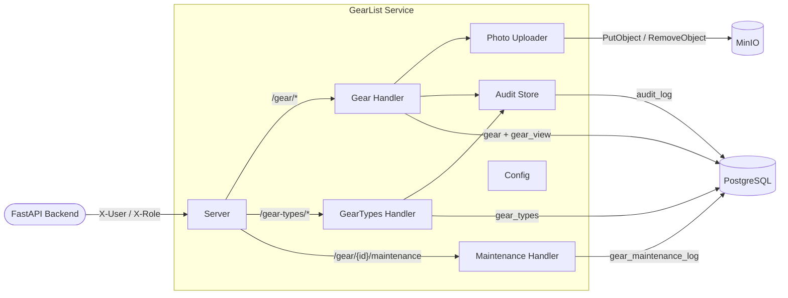

# L3 — GearList Service Components

> Components inside the GearList Service container.

| Component | Technology | Role |
|---|---|---|
| Server | Go / net/http | HTTP router, middleware chain, health check |
| Gear Handler | Go / pgx | CRUD for gear items; paginated list with name and type filtering |
| GearTypes Handler | Go / pgx | CRUD for the gear_types lookup table |
| Maintenance Handler | Go / pgx | Append-only maintenance event log per gear item |
| Photo Uploader | Go / minio-go | Validates Content-Type and size; uploads to MinIO; rolls back on DB failure |
| Audit Store | Go / pgx | Writes CREATE, UPDATE, DELETE entries to the shared audit_log |
| Config | Go | Loads APP_PORT, DB credentials, MinIO credentials from environment |
