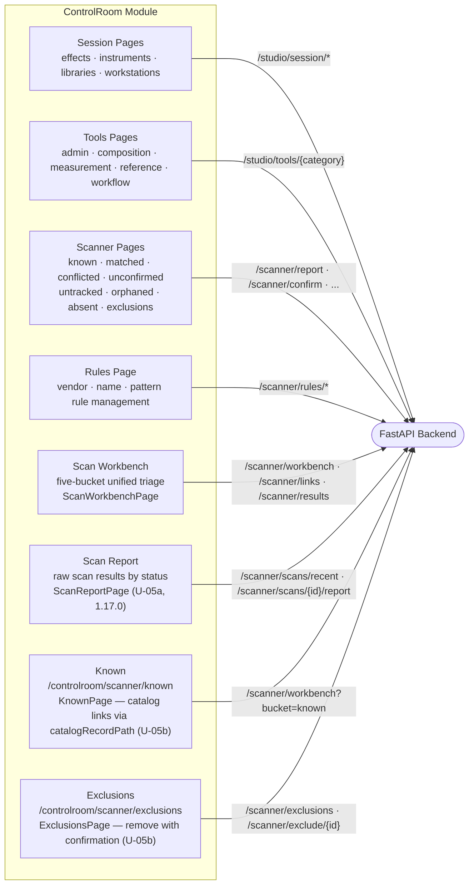
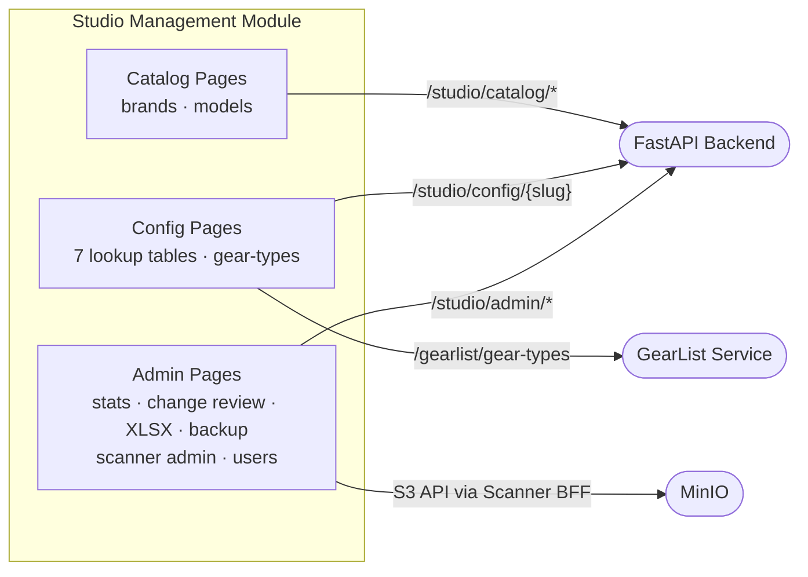

# L3 — Frontend Module Pages

> Page-level components within the Next.js Frontend, by module.

---

## ControlRoom (`app/controlroom/`)

```mermaid
graph LR
    subgraph controlroom ["ControlRoom Module"]
        session_pages["Session Pages\neffects · instruments · libraries · workstations"]
        tools_pages["Tools Pages\nadmin · composition · measurement · reference · workflow"]
        scanner_pages["Scanner Pages\nknown · matched · conflicted · unconfirmed\nuntracked · orphaned · absent · exclusions"]
        rules_pages["Rules Page\nvendor · name · pattern rule management"]
        workbench_page["Scan Workbench\nfive-bucket unified triage\nScanWorkbenchPage"]
        report_page["Scan Report\nraw scan results by status\nScanReportPage (U-05a, 1.17.0)"]
        known_page["Known\n/controlroom/scanner/known\nKnownPage — catalog links via catalogRecordPath (U-05b)"]
        exclusions_page["Exclusions\n/controlroom/scanner/exclusions\nExclusionsPage — remove with confirmation (U-05b)"]
    end

    backend(["FastAPI Backend"])

    session_pages -->|"/studio/session/*"| backend
    tools_pages -->|"/studio/tools/{category}"| backend
    scanner_pages -->|"/scanner/report · /scanner/confirm · ..."| backend
    rules_pages -->|"/scanner/rules/*"| backend
    workbench_page -->|"/scanner/workbench · /scanner/links · /scanner/results"| backend
    report_page -->|"/scanner/scans/recent · /scanner/scans/{id}/report"| backend
    known_page -->|"/scanner/workbench?bucket=known"| backend
    exclusions_page -->|"/scanner/exclusions · /scanner/exclude/{id}"| backend
```

---

## Studio Management (`app/studio/`)

```mermaid
graph LR
    subgraph studio ["Studio Management Module"]
        catalog_pages["Catalog Pages\nbrands · models"]
        config_pages["Config Pages\n7 lookup tables · gear-types"]
        admin_pages["Admin Pages\nstats · change review · XLSX · backup\nscanner admin · users"]
    end

    backend(["FastAPI Backend"])
    gearlist(["GearList Service"])
    minio(["MinIO"])

    catalog_pages -->|"/studio/catalog/*"| backend
    config_pages -->|"/studio/config/{slug}"| backend
    config_pages -->|"/gearlist/gear-types"| gearlist
    admin_pages -->|"/studio/admin/*"| backend
    admin_pages -->|"S3 API via Scanner BFF"| minio
```
