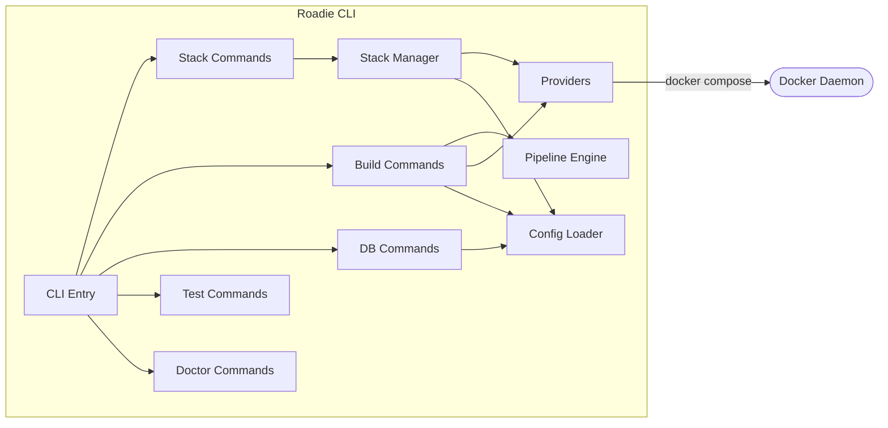

# L3 — Roadie CLI Components

> Components inside the Roadie CLI. Not a deployed service — runs on the developer's machine.

| Component | Technology | Role |
|---|---|---|
| CLI Entry | Go / Cobra | Root command with `--verbose`. Registers all subcommand groups. |
| Stack Commands | Go | `start`, `stop`, `restart`, `status` |
| Build Commands | Go | `build`, `release` — rebuilds images, applies schema, runs test suites |
| DB Commands | Go | `db init`, `db migrate` — first-time setup and incremental migrations |
| Test Commands | Go | `test unit/e2e/scan/perf/pbt/full` |
| Doctor Commands | Go | Prerequisite checks; automated fixes for secrets and agents |
| Stack Manager | Go | Orchestrates container lifecycle; health-polls every 2 s for up to 5 min |
| Pipeline Engine | Go | ToolStep + Pipeline; fatal-sequential and collect execution modes |
| Config Loader | Go / YAML | Reads and validates `roadie.yml` |
| Providers | Go | DockerProvider, PostgresProvider, HTTPChecker |
