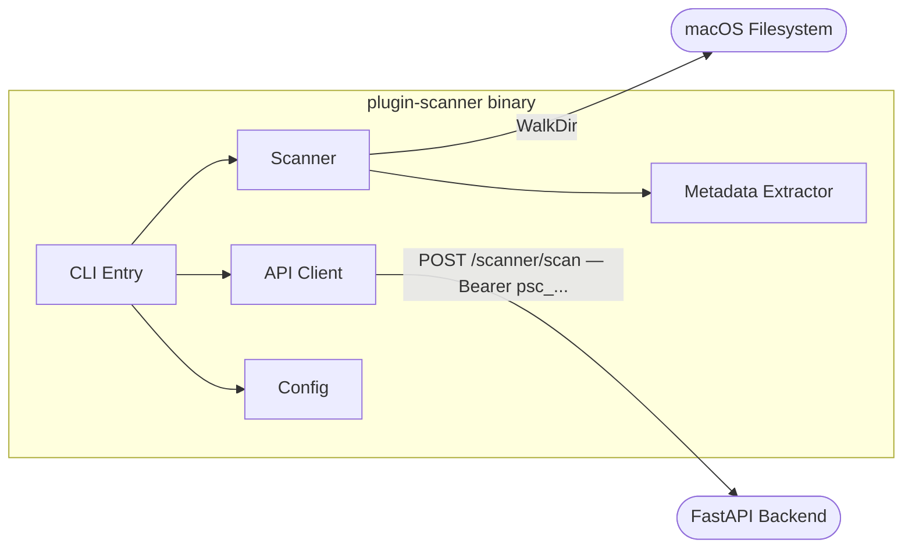

# L3 — Plugin Scanner Binary Components

> Components inside the plugin-scanner macOS CLI binary.

| Component | Technology | Role |
|---|---|---|
| CLI Entry | Go / Cobra | Root command — `scan`, `auth`, `version`, `config` subcommands |
| Scanner | Go | Concurrent directory walk per root; detects `.vst3`, `.component`, `.vst` |
| Metadata Extractor | Go | Reads `moduleinfo.json` (VST3), `Info.plist` (AU), bundle name (VST2) |
| API Client | Go / net/http | POSTs scan payload; Bearer API key; `X-Idempotency-Key`; 3-attempt backoff |
| Config | Go / YAML | Loads `~/.plugin-scanner.yml` — `api_key`, `server_url`, `machine_name`, `scan_paths` |
