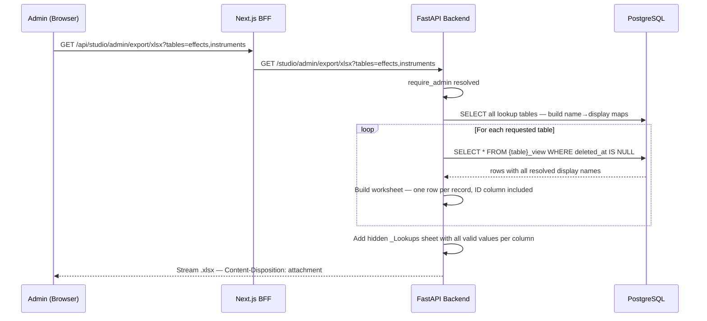
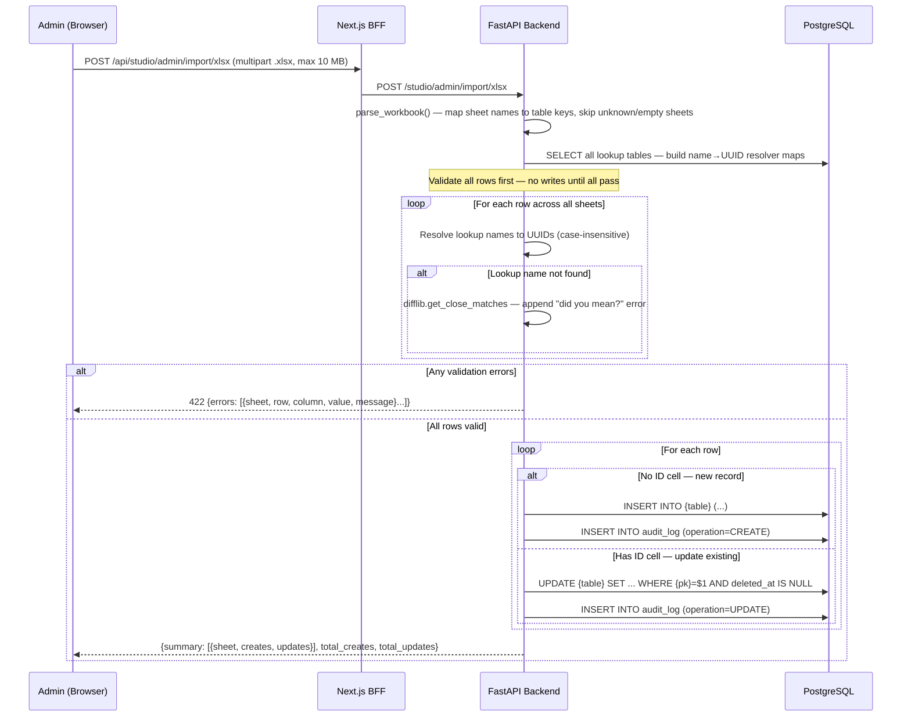
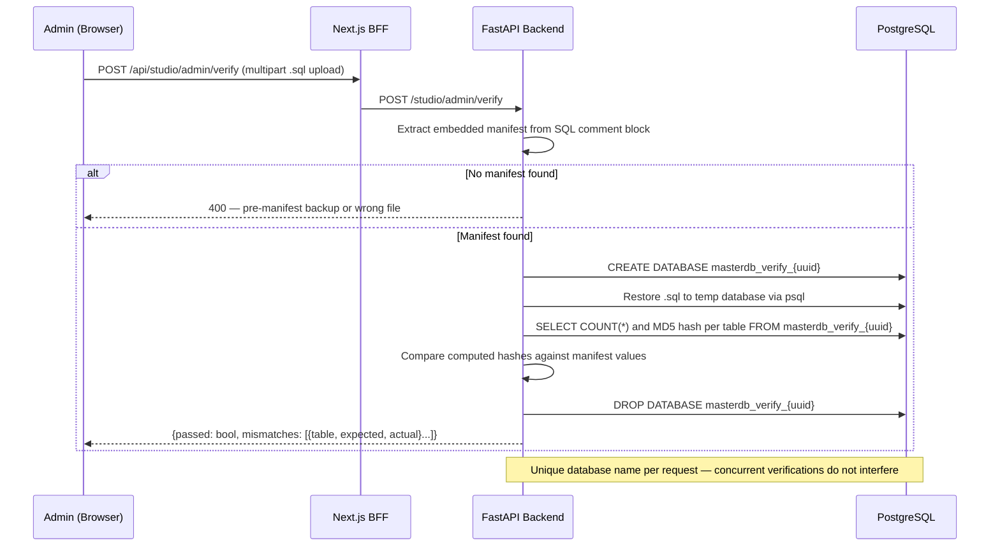
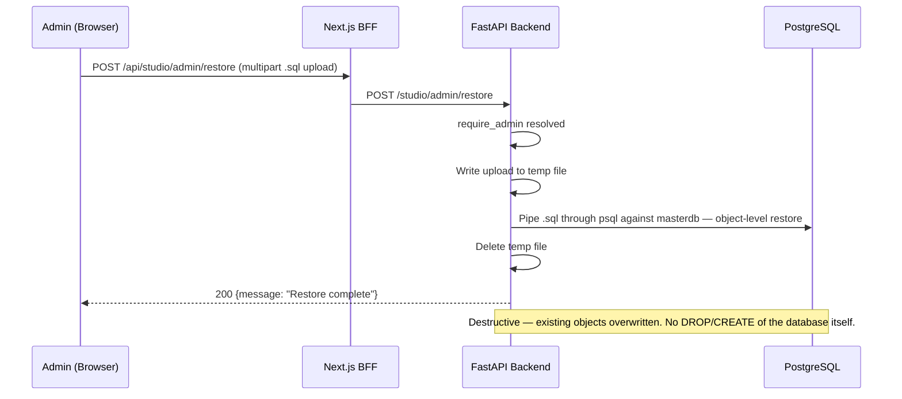

# Admin Flows

## XLSX Export



---

## XLSX Import



---

## pg_dump Backup

```mermaid
sequenceDiagram
    participant Admin as Admin (Browser)
    participant BFF as Next.js BFF
    participant FastAPI as FastAPI Backend
    participant DB as PostgreSQL

    Admin->>BFF: GET /api/studio/admin/backup
    BFF->>FastAPI: GET /studio/admin/backup + Bearer token
    FastAPI->>FastAPI: require_admin resolved
    FastAPI->>DB: SELECT COUNT(*) and MD5 hash per content table — build manifest
    FastAPI->>FastAPI: Spawn pg_dump subprocess against masterdb
    FastAPI->>FastAPI: Prepend manifest as SQL comment block at top of dump output
    FastAPI-->>Admin: Stream .sql file — Content-Disposition: attachment; filename=backup_{timestamp}.sql
```

---

## Backup Verify



---

## Backup Restore


