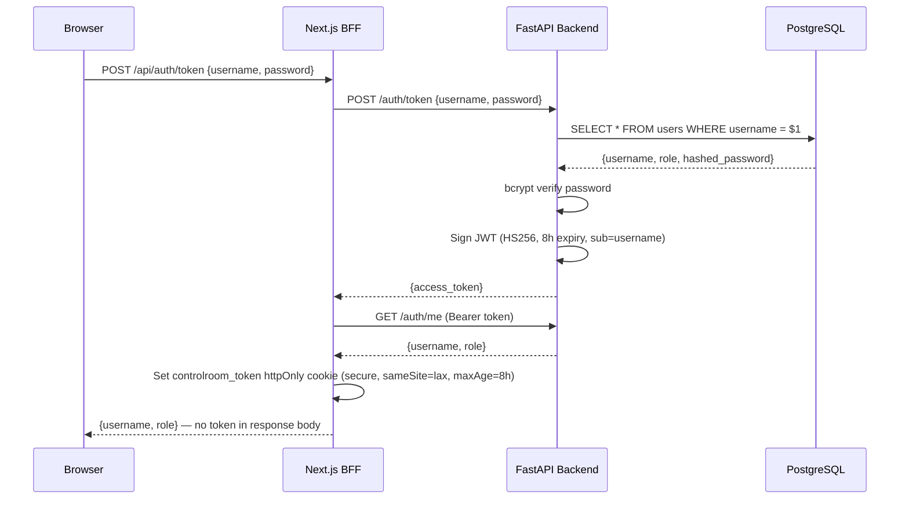
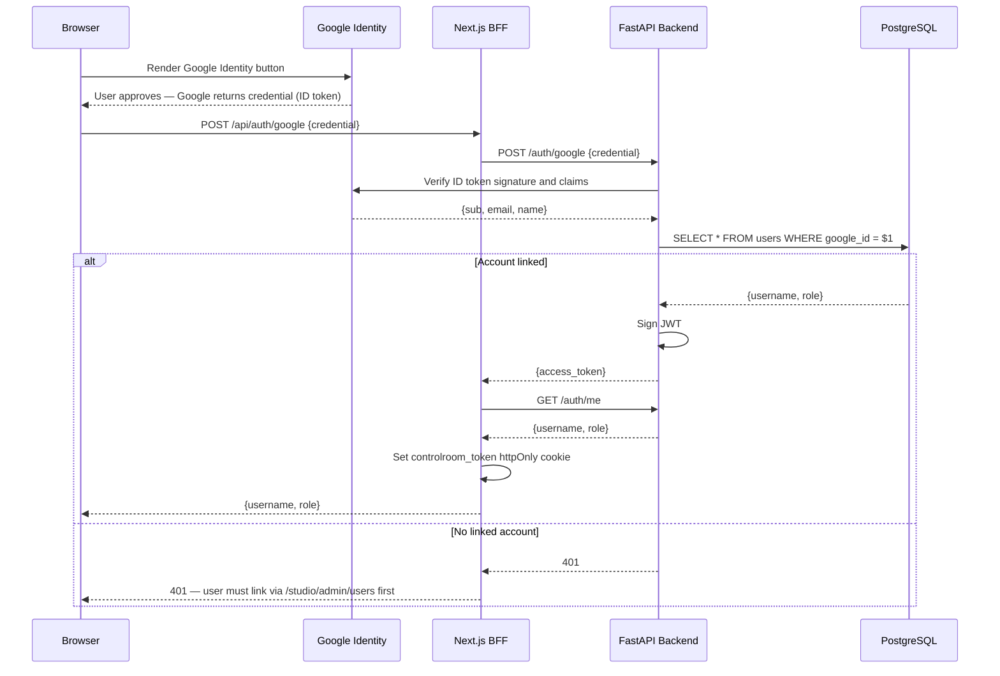
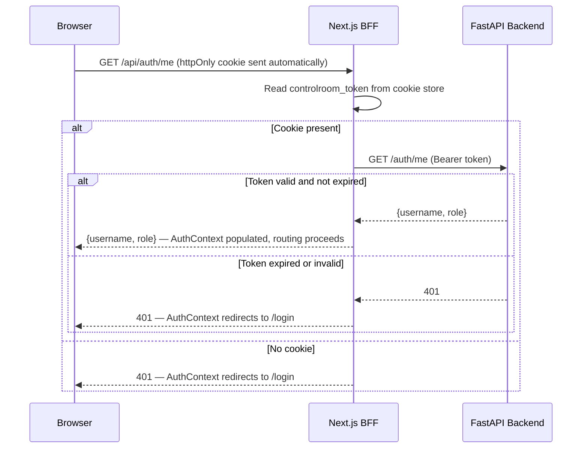
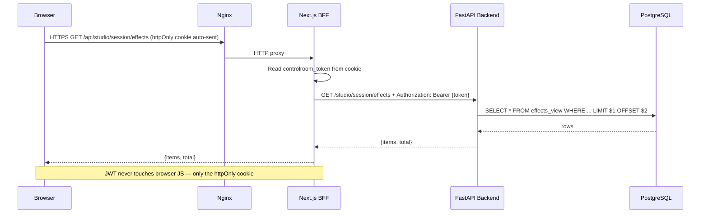
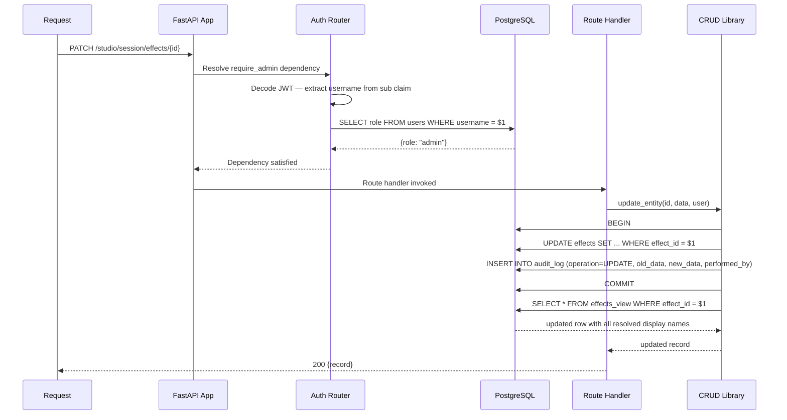

# Authentication Flows

## Username/Password Login

```mermaid
sequenceDiagram
    participant Browser
    participant BFF as Next.js BFF
    participant FastAPI as FastAPI Backend
    participant DB as PostgreSQL

    Browser->>BFF: POST /api/auth/token {username, password}
    BFF->>FastAPI: POST /auth/token {username, password}
    FastAPI->>DB: SELECT * FROM users WHERE username = $1
    DB-->>FastAPI: {username, role, hashed_password}
    FastAPI->>FastAPI: bcrypt verify password
    FastAPI->>FastAPI: Sign JWT (HS256, 8h expiry, sub=username)
    FastAPI-->>BFF: {access_token}
    BFF->>FastAPI: GET /auth/me (Bearer token)
    FastAPI-->>BFF: {username, role}
    BFF->>BFF: Set controlroom_token httpOnly cookie (secure, sameSite=lax, maxAge=8h)
    BFF-->>Browser: {username, role} — no token in response body
```

---

## Google SSO Login

```mermaid
sequenceDiagram
    participant Browser
    participant Google as Google Identity
    participant BFF as Next.js BFF
    participant FastAPI as FastAPI Backend
    participant DB as PostgreSQL

    Browser->>Google: Render Google Identity button
    Google-->>Browser: User approves — Google returns credential (ID token)
    Browser->>BFF: POST /api/auth/google {credential}
    BFF->>FastAPI: POST /auth/google {credential}
    FastAPI->>Google: Verify ID token signature and claims
    Google-->>FastAPI: {sub, email, name}
    FastAPI->>DB: SELECT * FROM users WHERE google_id = $1
    alt Account linked
        DB-->>FastAPI: {username, role}
        FastAPI->>FastAPI: Sign JWT
        FastAPI-->>BFF: {access_token}
        BFF->>FastAPI: GET /auth/me
        FastAPI-->>BFF: {username, role}
        BFF->>BFF: Set controlroom_token httpOnly cookie
        BFF-->>Browser: {username, role}
    else No linked account
        FastAPI-->>BFF: 401
        BFF-->>Browser: 401 — user must link via /studio/admin/users first
    end
```

---

## Session Check on App Mount

```mermaid
sequenceDiagram
    participant Browser
    participant BFF as Next.js BFF
    participant FastAPI as FastAPI Backend

    Browser->>BFF: GET /api/auth/me (httpOnly cookie sent automatically)
    BFF->>BFF: Read controlroom_token from cookie store
    alt Cookie present
        BFF->>FastAPI: GET /auth/me (Bearer token)
        alt Token valid and not expired
            FastAPI-->>BFF: {username, role}
            BFF-->>Browser: {username, role} — AuthContext populated, routing proceeds
        else Token expired or invalid
            FastAPI-->>BFF: 401
            BFF-->>Browser: 401 — AuthContext redirects to /login
        end
    else No cookie
        BFF-->>Browser: 401 — AuthContext redirects to /login
    end
```

---

## BFF JWT Flow (Normal API Call)

```mermaid
sequenceDiagram
    participant Browser
    participant Nginx
    participant BFF as Next.js BFF
    participant FastAPI as FastAPI Backend
    participant DB as PostgreSQL

    Browser->>Nginx: HTTPS GET /api/studio/session/effects (httpOnly cookie auto-sent)
    Nginx->>BFF: HTTP proxy
    BFF->>BFF: Read controlroom_token from cookie
    BFF->>FastAPI: GET /studio/session/effects + Authorization: Bearer {token}
    FastAPI->>DB: SELECT * FROM effects_view WHERE ... LIMIT $1 OFFSET $2
    DB-->>FastAPI: rows
    FastAPI-->>BFF: {items, total}
    BFF-->>Browser: {items, total}

    note over Browser,BFF: JWT never touches browser JS — only the httpOnly cookie
```

---

## FastAPI Auth Dependency Chain

```mermaid
sequenceDiagram
    participant Request
    participant FastAPI as FastAPI App
    participant AuthRouter as Auth Router
    participant DB as PostgreSQL
    participant Router as Route Handler
    participant CRUDLib as CRUD Library

    Request->>FastAPI: PATCH /studio/session/effects/{id}
    FastAPI->>AuthRouter: Resolve require_admin dependency
    AuthRouter->>AuthRouter: Decode JWT — extract username from sub claim
    AuthRouter->>DB: SELECT role FROM users WHERE username = $1
    DB-->>AuthRouter: {role: "admin"}
    AuthRouter-->>FastAPI: Dependency satisfied
    FastAPI->>Router: Route handler invoked
    Router->>CRUDLib: update_entity(id, data, user)
    CRUDLib->>DB: BEGIN
    CRUDLib->>DB: UPDATE effects SET ... WHERE effect_id = $1
    CRUDLib->>DB: INSERT INTO audit_log (operation=UPDATE, old_data, new_data, performed_by)
    CRUDLib->>DB: COMMIT
    CRUDLib->>DB: SELECT * FROM effects_view WHERE effect_id = $1
    DB-->>CRUDLib: updated row with all resolved display names
    CRUDLib-->>Router: updated record
    Router-->>Request: 200 {record}
```
