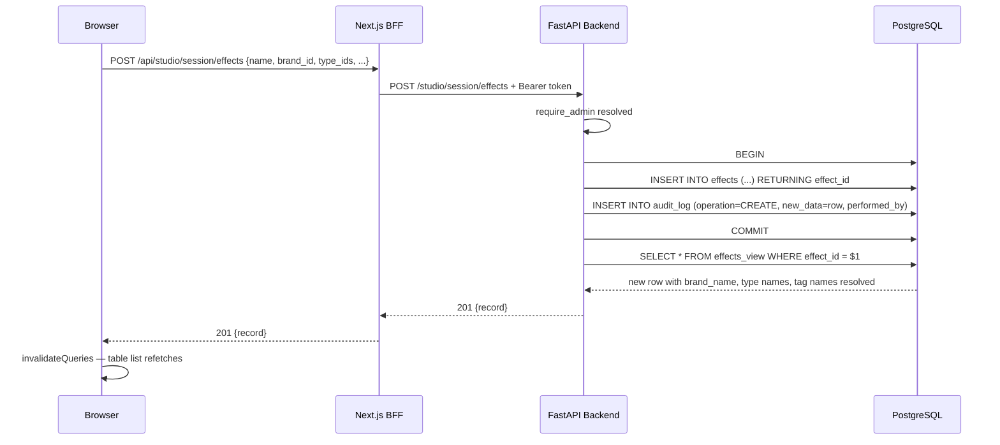
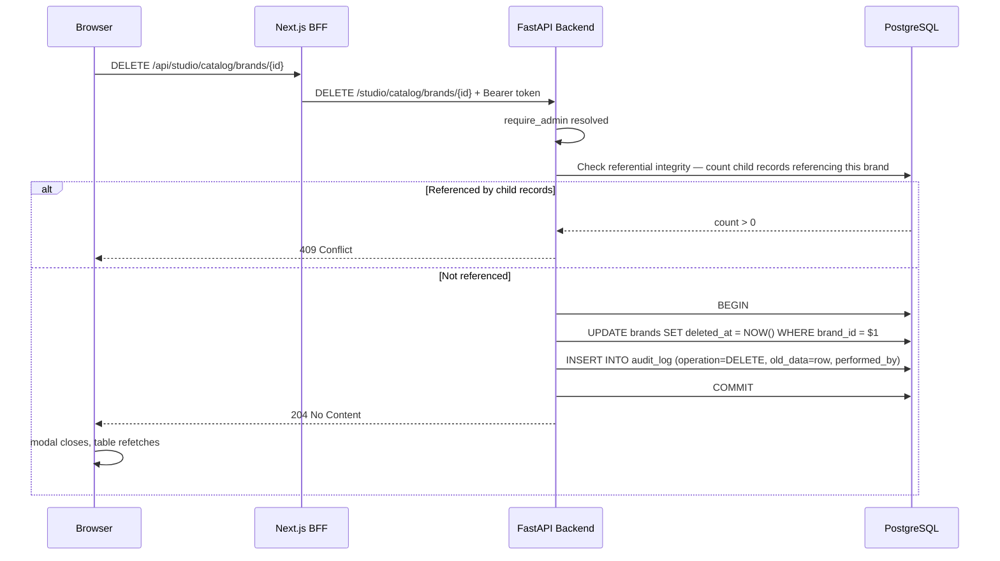
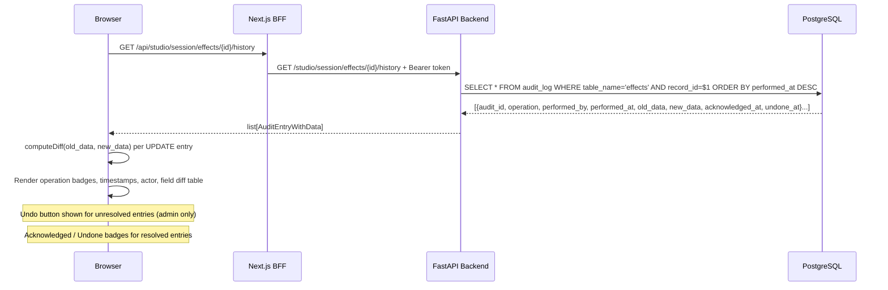

# Catalog Flows

## Create Record

```mermaid
sequenceDiagram
    participant Browser
    participant BFF as Next.js BFF
    participant FastAPI as FastAPI Backend
    participant DB as PostgreSQL

    Browser->>BFF: POST /api/studio/session/effects {name, brand_id, type_ids, ...}
    BFF->>FastAPI: POST /studio/session/effects + Bearer token
    FastAPI->>FastAPI: require_admin resolved
    FastAPI->>DB: BEGIN
    FastAPI->>DB: INSERT INTO effects (...) RETURNING effect_id
    FastAPI->>DB: INSERT INTO audit_log (operation=CREATE, new_data=row, performed_by)
    FastAPI->>DB: COMMIT
    FastAPI->>DB: SELECT * FROM effects_view WHERE effect_id = $1
    DB-->>FastAPI: new row with brand_name, type names, tag names resolved
    FastAPI-->>BFF: 201 {record}
    BFF-->>Browser: 201 {record}
    Browser->>Browser: invalidateQueries — table list refetches
```

---

## Soft Delete

```mermaid
sequenceDiagram
    participant Browser
    participant BFF as Next.js BFF
    participant FastAPI as FastAPI Backend
    participant DB as PostgreSQL

    Browser->>BFF: DELETE /api/studio/catalog/brands/{id}
    BFF->>FastAPI: DELETE /studio/catalog/brands/{id} + Bearer token
    FastAPI->>FastAPI: require_admin resolved
    FastAPI->>DB: Check referential integrity — count child records referencing this brand
    alt Referenced by child records
        DB-->>FastAPI: count > 0
        FastAPI-->>Browser: 409 Conflict
    else Not referenced
        FastAPI->>DB: BEGIN
        FastAPI->>DB: UPDATE brands SET deleted_at = NOW() WHERE brand_id = $1
        FastAPI->>DB: INSERT INTO audit_log (operation=DELETE, old_data=row, performed_by)
        FastAPI->>DB: COMMIT
        FastAPI-->>Browser: 204 No Content
        Browser->>Browser: modal closes, table refetches
    end
```

---

## Record History View

```mermaid
sequenceDiagram
    participant Browser
    participant BFF as Next.js BFF
    participant FastAPI as FastAPI Backend
    participant DB as PostgreSQL

    Browser->>BFF: GET /api/studio/session/effects/{id}/history
    BFF->>FastAPI: GET /studio/session/effects/{id}/history + Bearer token
    FastAPI->>DB: SELECT * FROM audit_log WHERE table_name='effects' AND record_id=$1 ORDER BY performed_at DESC
    DB-->>FastAPI: [{audit_id, operation, performed_by, performed_at, old_data, new_data, acknowledged_at, undone_at}...]
    FastAPI-->>Browser: list[AuditEntryWithData]

    Browser->>Browser: computeDiff(old_data, new_data) per UPDATE entry
    Browser->>Browser: Render operation badges, timestamps, actor, field diff table
    note over Browser: Undo button shown for unresolved entries (admin only)
    note over Browser: Acknowledged / Undone badges for resolved entries
```
