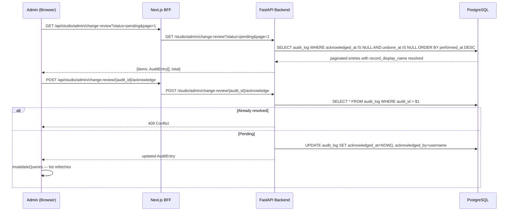
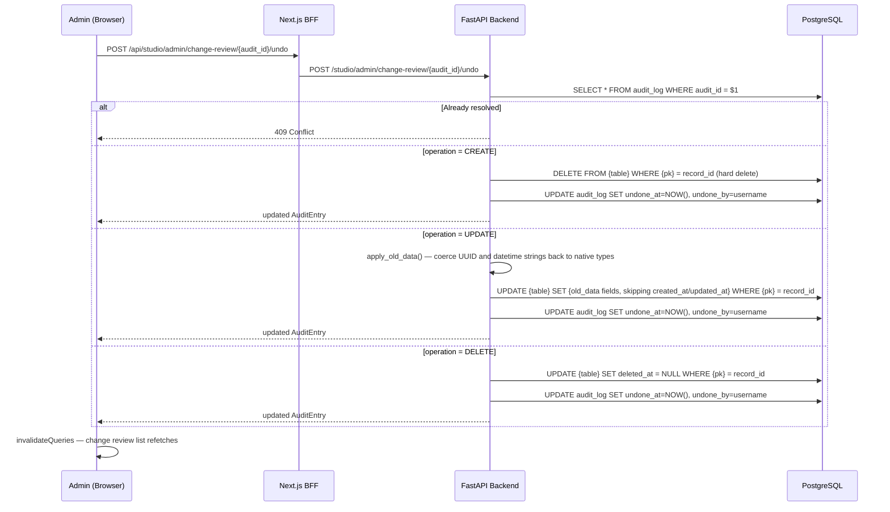
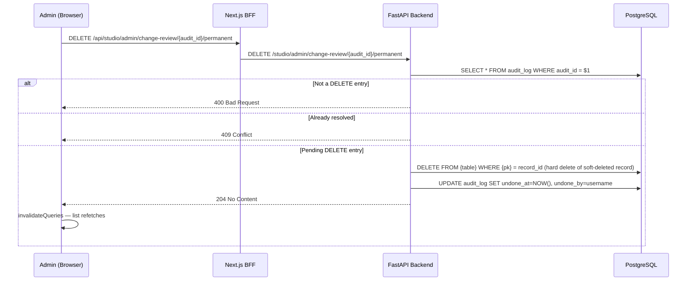

# Change Review Flows

## Acknowledge

```mermaid
sequenceDiagram
    participant Admin as Admin (Browser)
    participant BFF as Next.js BFF
    participant FastAPI as FastAPI Backend
    participant DB as PostgreSQL

    Admin->>BFF: GET /api/studio/admin/change-review?status=pending&page=1
    BFF->>FastAPI: GET /studio/admin/change-review?status=pending&page=1
    FastAPI->>DB: SELECT audit_log WHERE acknowledged_at IS NULL AND undone_at IS NULL ORDER BY performed_at DESC
    DB-->>FastAPI: paginated entries with record_display_name resolved
    FastAPI-->>Admin: {items: AuditEntry[], total}

    Admin->>BFF: POST /api/studio/admin/change-review/{audit_id}/acknowledge
    BFF->>FastAPI: POST /studio/admin/change-review/{audit_id}/acknowledge
    FastAPI->>DB: SELECT * FROM audit_log WHERE audit_id = $1
    alt Already resolved
        FastAPI-->>Admin: 409 Conflict
    else Pending
        FastAPI->>DB: UPDATE audit_log SET acknowledged_at=NOW(), acknowledged_by=username
        FastAPI-->>Admin: updated AuditEntry
        Admin->>Admin: invalidateQueries — list refetches
    end
```

---

## Undo

```mermaid
sequenceDiagram
    participant Admin as Admin (Browser)
    participant BFF as Next.js BFF
    participant FastAPI as FastAPI Backend
    participant DB as PostgreSQL

    Admin->>BFF: POST /api/studio/admin/change-review/{audit_id}/undo
    BFF->>FastAPI: POST /studio/admin/change-review/{audit_id}/undo
    FastAPI->>DB: SELECT * FROM audit_log WHERE audit_id = $1
    alt Already resolved
        FastAPI-->>Admin: 409 Conflict
    else operation = CREATE
        FastAPI->>DB: DELETE FROM {table} WHERE {pk} = record_id (hard delete)
        FastAPI->>DB: UPDATE audit_log SET undone_at=NOW(), undone_by=username
        FastAPI-->>Admin: updated AuditEntry
    else operation = UPDATE
        FastAPI->>FastAPI: apply_old_data() — coerce UUID and datetime strings back to native types
        FastAPI->>DB: UPDATE {table} SET {old_data fields, skipping created_at/updated_at} WHERE {pk} = record_id
        FastAPI->>DB: UPDATE audit_log SET undone_at=NOW(), undone_by=username
        FastAPI-->>Admin: updated AuditEntry
    else operation = DELETE
        FastAPI->>DB: UPDATE {table} SET deleted_at = NULL WHERE {pk} = record_id
        FastAPI->>DB: UPDATE audit_log SET undone_at=NOW(), undone_by=username
        FastAPI-->>Admin: updated AuditEntry
    end
    Admin->>Admin: invalidateQueries — change review list refetches
```

---

## Permanent Delete

```mermaid
sequenceDiagram
    participant Admin as Admin (Browser)
    participant BFF as Next.js BFF
    participant FastAPI as FastAPI Backend
    participant DB as PostgreSQL

    Admin->>BFF: DELETE /api/studio/admin/change-review/{audit_id}/permanent
    BFF->>FastAPI: DELETE /studio/admin/change-review/{audit_id}/permanent
    FastAPI->>DB: SELECT * FROM audit_log WHERE audit_id = $1
    alt Not a DELETE entry
        FastAPI-->>Admin: 400 Bad Request
    else Already resolved
        FastAPI-->>Admin: 409 Conflict
    else Pending DELETE entry
        FastAPI->>DB: DELETE FROM {table} WHERE {pk} = record_id (hard delete of soft-deleted record)
        FastAPI->>DB: UPDATE audit_log SET undone_at=NOW(), undone_by=username
        FastAPI-->>Admin: 204 No Content
        Admin->>Admin: invalidateQueries — list refetches
    end
```
