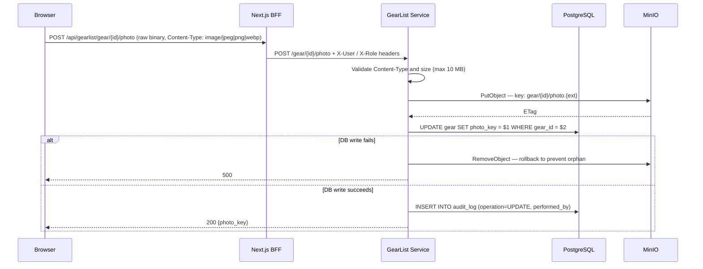
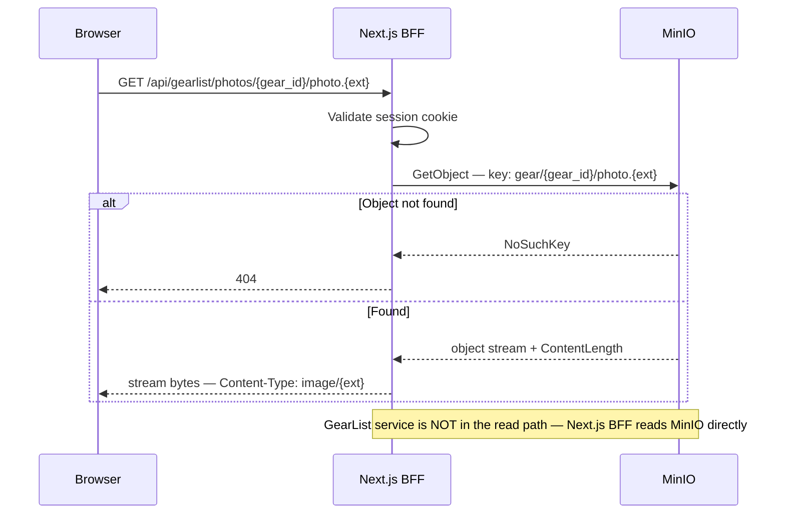
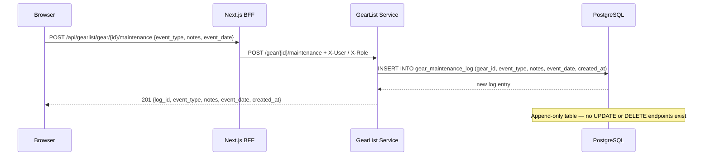

# GearList Flows

## Gear Photo Upload

```mermaid
sequenceDiagram
    participant Browser
    participant BFF as Next.js BFF
    participant GearList as GearList Service
    participant DB as PostgreSQL
    participant MinIO

    Browser->>BFF: POST /api/gearlist/gear/{id}/photo (raw binary, Content-Type: image/jpeg|png|webp)
    BFF->>GearList: POST /gear/{id}/photo + X-User / X-Role headers
    GearList->>GearList: Validate Content-Type and size (max 10 MB)
    GearList->>MinIO: PutObject — key: gear/{id}/photo.{ext}
    MinIO-->>GearList: ETag
    GearList->>DB: UPDATE gear SET photo_key = $1 WHERE gear_id = $2
    alt DB write fails
        GearList->>MinIO: RemoveObject — rollback to prevent orphan
        GearList-->>Browser: 500
    else DB write succeeds
        GearList->>DB: INSERT INTO audit_log (operation=UPDATE, performed_by)
        GearList-->>Browser: 200 {photo_key}
    end
```

---

## Gear Photo Delivery

```mermaid
sequenceDiagram
    participant Browser
    participant BFF as Next.js BFF
    participant MinIO

    Browser->>BFF: GET /api/gearlist/photos/{gear_id}/photo.{ext}
    BFF->>BFF: Validate session cookie
    BFF->>MinIO: GetObject — key: gear/{gear_id}/photo.{ext}
    alt Object not found
        MinIO-->>BFF: NoSuchKey
        BFF-->>Browser: 404
    else Found
        MinIO-->>BFF: object stream + ContentLength
        BFF-->>Browser: stream bytes — Content-Type: image/{ext}
    end

    note over BFF,MinIO: GearList service is NOT in the read path — Next.js BFF reads MinIO directly
```

---

## Maintenance Log Append

```mermaid
sequenceDiagram
    participant Browser
    participant BFF as Next.js BFF
    participant GearList as GearList Service
    participant DB as PostgreSQL

    Browser->>BFF: POST /api/gearlist/gear/{id}/maintenance {event_type, notes, event_date}
    BFF->>GearList: POST /gear/{id}/maintenance + X-User / X-Role
    GearList->>DB: INSERT INTO gear_maintenance_log (gear_id, event_type, notes, event_date, created_at)
    DB-->>GearList: new log entry
    GearList-->>Browser: 201 {log_id, event_type, notes, event_date, created_at}

    note over DB: Append-only table — no UPDATE or DELETE endpoints exist
```
