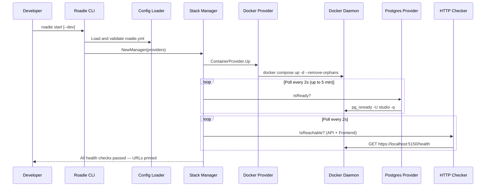
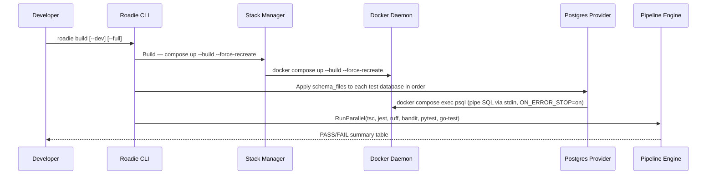

# Infrastructure Flows

## Roadie Start

```mermaid
sequenceDiagram
    participant Dev as Developer
    participant CLI as Roadie CLI
    participant Config as Config Loader
    participant Manager as Stack Manager
    participant Docker as Docker Provider
    participant Daemon as Docker Daemon
    participant Postgres as Postgres Provider
    participant HTTP as HTTP Checker

    Dev->>CLI: roadie start [--dev]
    CLI->>Config: Load and validate roadie.yml
    CLI->>Manager: NewManager(providers)
    Manager->>Docker: ContainerProvider.Up
    Docker->>Daemon: docker compose up -d --remove-orphans
    loop Poll every 2s (up to 5 min)
        Manager->>Postgres: IsReady?
        Postgres->>Daemon: pg_isready -U studio -q
    end
    loop Poll every 2s
        Manager->>HTTP: IsReachable? (API + Frontend)
        HTTP->>Daemon: GET https://localhost:5150/health
    end
    Manager-->>Dev: All health checks passed — URLs printed
```

---

## Roadie Build

```mermaid
sequenceDiagram
    participant Dev as Developer
    participant CLI as Roadie CLI
    participant Manager as Stack Manager
    participant Docker as Docker Daemon
    participant Postgres as Postgres Provider
    participant Pipeline as Pipeline Engine

    Dev->>CLI: roadie build [--dev] [--full]
    CLI->>Manager: Build — compose up --build --force-recreate
    Manager->>Docker: docker compose up --build --force-recreate
    CLI->>Postgres: Apply schema_files to each test database in order
    Postgres->>Docker: docker compose exec psql (pipe SQL via stdin, ON_ERROR_STOP=on)
    CLI->>Pipeline: RunParallel(tsc, jest, ruff, bandit, pytest, go-test)
    Pipeline-->>Dev: PASS/FAIL summary table
```
