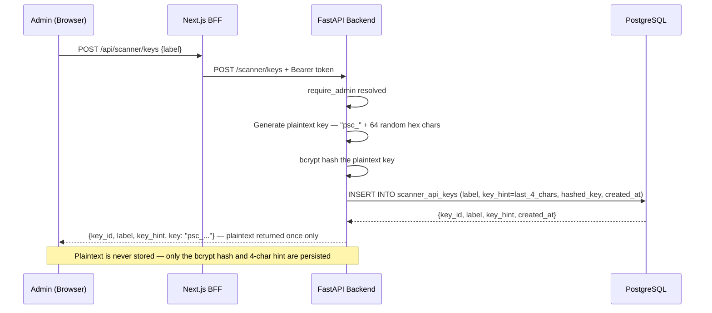
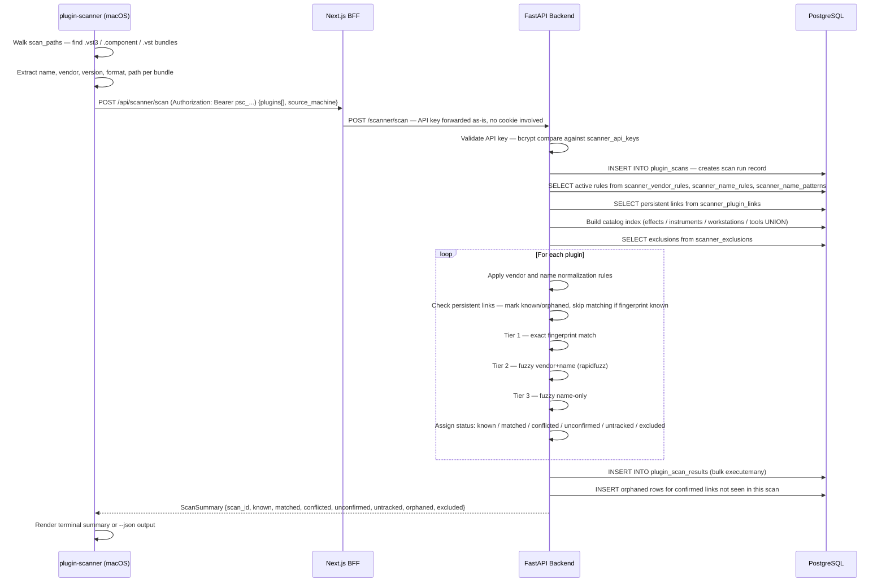
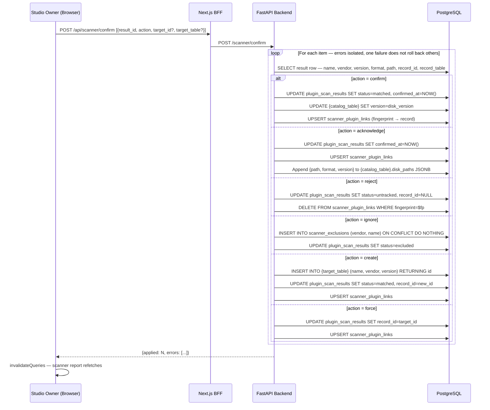

# Scanner Flows

## API Key Creation



---

## Scan Ingest



---

## Confirmation Actions



---

## Release Download

```mermaid
sequenceDiagram
    participant Browser
    participant BFF as Next.js BFF
    participant MinIO

    Browser->>BFF: GET /api/scanner/download/latest
    BFF->>BFF: Validate session cookie
    BFF->>MinIO: ListObjectsV2 — Bucket: studio-downloads, Prefix: plugin-scanner/
    MinIO-->>BFF: [{Key, LastModified, Size}...]
    BFF->>BFF: Sort by LastModified desc — parse version from filename
    BFF-->>Browser: {key, version, released_at, size_bytes}

    Browser->>Browser: User clicks Download
    Browser->>BFF: GET /api/scanner/download/url?key={object-key}
    BFF->>BFF: Validate session cookie
    BFF->>MinIO: GetObject — stream zip bytes
    MinIO-->>BFF: object body stream + ContentLength
    BFF-->>Browser: stream — Content-Disposition: attachment; filename=plugin-scanner-{version}.zip
```
