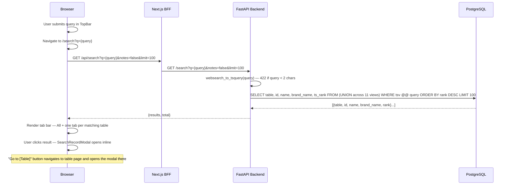
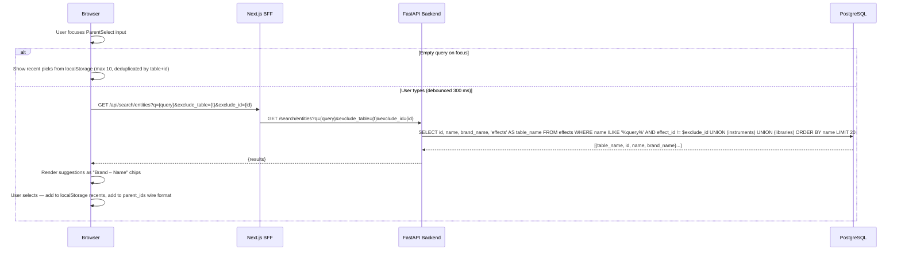
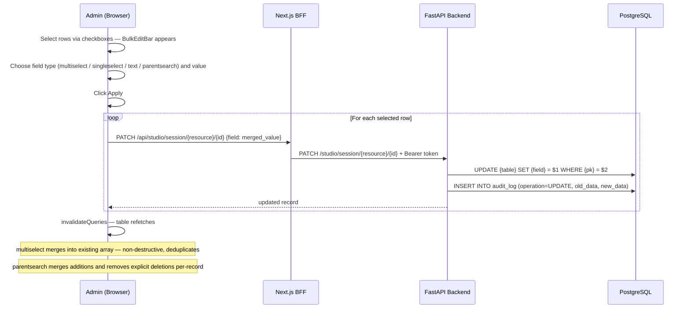

# Search and Bulk Edit Flows

## Global Search

```mermaid
sequenceDiagram
    participant Browser
    participant BFF as Next.js BFF
    participant FastAPI as FastAPI Backend
    participant DB as PostgreSQL

    Browser->>Browser: User submits query in TopBar
    Browser->>Browser: Navigate to /search?q={query}
    Browser->>BFF: GET /api/search?q={query}&notes=false&limit=100
    BFF->>FastAPI: GET /search?q={query}&notes=false&limit=100
    FastAPI->>FastAPI: websearch_to_tsquery(query) — 422 if query < 2 chars
    FastAPI->>DB: SELECT table, id, name, brand_name, ts_rank FROM (UNION across 11 views) WHERE tsv @@ query ORDER BY rank DESC LIMIT 100
    DB-->>FastAPI: [{table, id, name, brand_name, rank}...]
    FastAPI-->>Browser: {results, total}
    Browser->>Browser: Render tab bar — All + one tab per matching table
    Browser->>Browser: User clicks result — SearchRecordModal opens inline
    note over Browser: "Go to [Table]" button navigates to table page and opens the modal there
```

---

## Entity Typeahead (ParentSelect)

```mermaid
sequenceDiagram
    participant Browser
    participant BFF as Next.js BFF
    participant FastAPI as FastAPI Backend
    participant DB as PostgreSQL

    Browser->>Browser: User focuses ParentSelect input
    alt Empty query on focus
        Browser->>Browser: Show recent picks from localStorage (max 10, deduplicated by table+id)
    else User types (debounced 300 ms)
        Browser->>BFF: GET /api/search/entities?q={query}&exclude_table={t}&exclude_id={id}
        BFF->>FastAPI: GET /search/entities?q={query}&exclude_table={t}&exclude_id={id}
        FastAPI->>DB: SELECT id, name, brand_name, 'effects' AS table_name FROM effects WHERE name ILIKE '%query%' AND effect_id != $exclude_id UNION (instruments) UNION (libraries) ORDER BY name LIMIT 20
        DB-->>FastAPI: [{table_name, id, name, brand_name}...]
        FastAPI-->>Browser: {results}
        Browser->>Browser: Render suggestions as "Brand – Name" chips
        Browser->>Browser: User selects — add to localStorage recents, add to parent_ids wire format
    end
```

---

## Bulk Edit Apply

```mermaid
sequenceDiagram
    participant Admin as Admin (Browser)
    participant BFF as Next.js BFF
    participant FastAPI as FastAPI Backend
    participant DB as PostgreSQL

    Admin->>Admin: Select rows via checkboxes — BulkEditBar appears
    Admin->>Admin: Choose field type (multiselect / singleselect / text / parentsearch) and value
    Admin->>Admin: Click Apply
    loop For each selected row
        Admin->>BFF: PATCH /api/studio/session/{resource}/{id} {field: merged_value}
        BFF->>FastAPI: PATCH /studio/session/{resource}/{id} + Bearer token
        FastAPI->>DB: UPDATE {table} SET {field} = $1 WHERE {pk} = $2
        FastAPI->>DB: INSERT INTO audit_log (operation=UPDATE, old_data, new_data)
        FastAPI-->>Admin: updated record
    end
    Admin->>Admin: invalidateQueries — table refetches

    note over Admin: multiselect merges into existing array — non-destructive, deduplicates
    note over Admin: parentsearch merges additions and removes explicit deletions per-record
```
